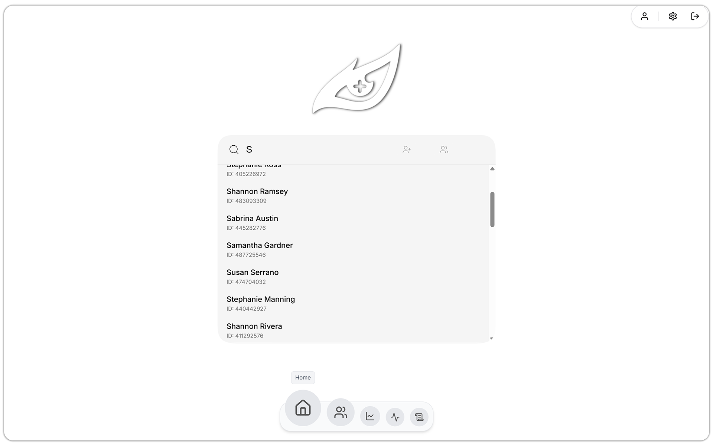
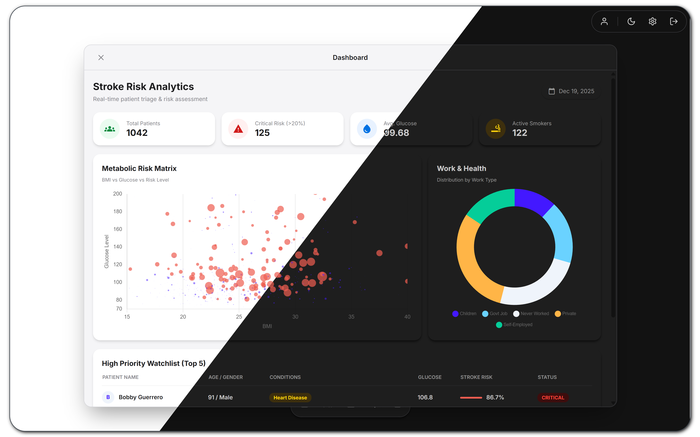
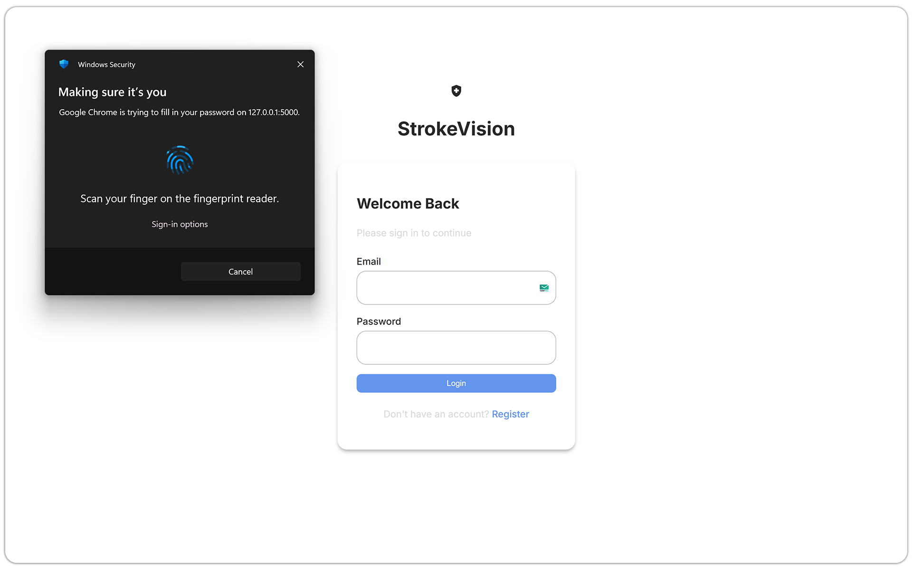
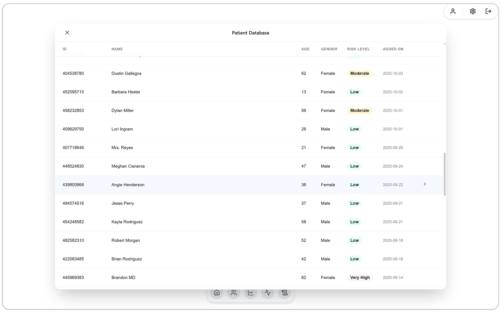
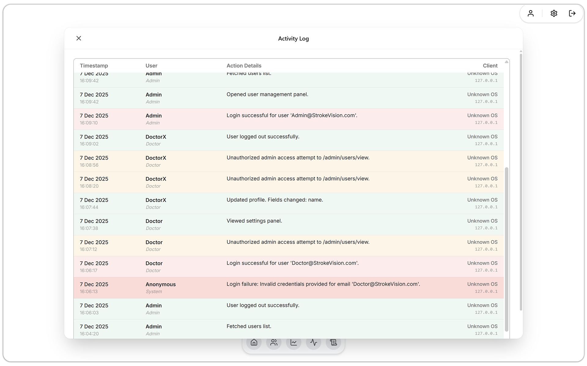
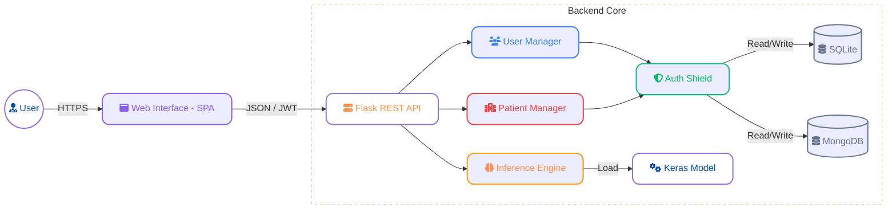

<div align="center">

# 🧠 StrokeVision

### Decision Support System for Early Stroke Detection & Patient Management

[](https://www.python.org/) [](https://flask.palletsprojects.com/) [](https://www.tensorflow.org/) [](https://www.mongodb.com/) [](./LICENSE) [](#-security-architecture)

<br>

**StrokeVision** is a **Single Page Application (SPA)** designed to revolutionize early stroke detection. By combining **Clinical Data Management** with **Deep Learning**, it provides healthcare professionals with instant, risk assessments in a secure, intuitive, and beautifully designed environment.

</div>

---

# Project UI

<table width="100%" border="0" cellspacing="0" cellpadding="0">
  <tr>
    <td colspan="2" width="100%"  style="border: solid transparent">
      
    </td>
  </tr>
  <tr>
    <td width="50%"  style="border: solid transparent">
      
    </td>
    <td width="50%"  style="border: solid transparent">
      
    </td>
  </tr>
  <tr>
    <td width="50%"  style="border: solid transparent">
      
    </td>
    <td width="50%"  style="border: solid transparent">
      
    </td>
  </tr>
</table>

## 📌 Overview

StrokeVision is a comprehensive web-based clinical support tool built for educational purposes. It empowers authenticated healthcare staff to:

- 🏥 **Manage Patient Records**: Full **CRUD** (Create, Read, Update, Delete) operations on patient health data stored in a secure MongoDB database.
- 🤖 **Predict Stroke Risk**: Utilize a powerful, pre-trained **Keras/TensorFlow Neural Network** to analyze patient data and generate a stroke probability score.
- 📊 **Explore Analytics**: An interactive **dashboard** with headline statistics and visual insights into patient data.
- 👥 **Administer Users**: A dedicated admin panel for managing user accounts, roles, and access control.

> ⚠️ **Note:** This system is for **educational purposes only** and must not be used for real clinical decision-making.

---

## ✨ Key Features

<div align="center">

|                                                                                    🛡️ **Security**                                                                                    |                                                                                 🎨 **Premium UI/UX**                                                                                  |                                                                        🤖 **AI-Driven Core**                                                                        |
| :-----------------------------------------------------------------------------------------------------------------------------------------------------------------------------------: | :-----------------------------------------------------------------------------------------------------------------------------------------------------------------------------------: | :-----------------------------------------------------------------------------------------------------------------------------------------------------------------: |
| Built with a **Security-First** mindset. Features **Hybrid JWT/Session Authentication**, **Bcrypt Hashing**, and **CSRF Protection** to ensure patient data integrity and compliance. | A fully responsive **Single-Page Application (SPA)** built with Vanilla ES6+ JavaScript. Features a clean, clinical aesthetic optimized for medical workflows with smooth navigation. | Powered by a custom-trained **Keras/TensorFlow Neural Network**. Delivers high-precision probability scores for stroke risk based on comprehensive patient metrics. |

</div>

---

### 🩺 Patient Data Management

Full **CRUD** functionality for managing patient health records:

- ➕ **Create**: Add new patient entries with comprehensive health information.
- 👁️ **View**: Browse all records or view detailed patient profiles.
- ✏️ **Edit**: Update existing patient information securely.
- ❌ **Delete**: Remove patient records with confirmation safeguards.
- 🔍 **Search**: Find patients quickly with the integrated **real-time** search functionality.

---

### 📊 Dashboard & Analytics

The interactive dashboard provides valuable clinical insights at a glance:

- 👥 Total number of patients in the system
- 📈 Key health metrics and averages
- 🩻 Risk factor distribution (Hypertension, Heart Disease)
- 🧬 AI Model prediction statistics

---

## 🏗️ Architecture

StrokeVision utilizes a modern, **decoupled architecture** to ensure scalability, performance, and security. The **Flask Backend** serves as a secure **RESTful API** gateway, while the client-side JavaScript router manages the seamless **Single Page Application (SPA)** experience.



### 📁 Project Structure (Overview)

<div style="display: flex; align-items: flex-start; gap: 20px;">
  
  <div>
    <h4>Structure Details</h4>
    <p>StrokeVision's codebase is organized into a clear, modular structure:</p>
    <ul>
      <li><code style="font-weight: 900">static/</code>: Houses the entire Single Page Application (SPA) frontend styling & logic, including JavaScript modules, CSS, client-side routing and pre-trained ML Model.</li>
      <li><code style="font-weight: 900">views/</code>: Contains the Flask backend application, defining RESTful API endpoints, logic, authentication handlers, and database interfaces.</li>
    <li><code style="font-weight: 900">models/</code>: Defines database schemas for MongoDB (patient records and application logs) and SQLite (user authentication and management).</li>
    <li><code style="font-weight: 900">unit_tests/</code>: Contains unit test files utilizing pytest for ensuring code quality and functionality.</li>
    <li><code style="font-weight: 900">docs/</code>: Houses project documentation, architectural diagrams, and other valuable resources.</li>
    <li><code style="font-weight: 900">utils/</code>: A collection of shared utility functions and helper scripts used throughout the application.</li>
    <li><code style="font-weight: 900">.env</code>: Manages environment variables for secure configuration, including API keys and sensitive data.</li>
    </ul>
  </div>
</div>

---

## 🛡️ Security Architecture

StrokeVision is built from the ground up with multiple layers of protection aligned with **GDPR & OWASP best practices**.

| Security Feature             | Implementation                                                                                              |
| :--------------------------- | :---------------------------------------------------------------------------------------------------------- |
| 🔒 **Hybrid Authentication** | Combines secure server-side **Flask-Login sessions** with **Flask-JWT-Extended** for flexible API access.   |
| � **Password Hashing**       | User passwords are never stored in plain text. All passwords are hashed using industry-standard **Bcrypt**. |
| �️ **CSRF Protection**       | Comprehensive **Cross-Site Request Forgery** protection on all state-changing endpoints via **Flask-WTF**.  |
| ✅ **Input Sanitization**    | Rigorous server-side validation on all forms to prevent SQL Injection and XSS attacks.                      |
| 🍪 **Secure Cookies**        | Session cookies are configured with `HttpOnly`, `Secure`, and `SameSite` flags.                             |
| 📜 **Secure Headers**        | Implements best-practice HTTP security headers (HSTS, X-Frame-Options, X-Content-Type-Options).             |
| 🔐 **Secrets Management**    | All sensitive keys and URIs are managed via a `.env` file, never hard-coded.                                |

---

## 🧪 Technology Stack

<div align="center">

| **Category**          |                                                                                                   **Technology**                                                                                                   | **Purpose**                                                   |
| :-------------------- | :----------------------------------------------------------------------------------------------------------------------------------------------------------------------------------------------------------------: | :------------------------------------------------------------ |
| **Backend Framework** |                                                                                                                   | Lightweight, secure WSGI web application framework.           |
| **Machine Learning**  |   | Deep learning framework for model training and inference.     |
| **Patient Database**  |                                                                                                             | NoSQL database for flexible, scalable patient record storage. |
| **User Database**     |                                                                                                                | Lightweight relational database for user authentication data. |
| **Frontend**          |      | Native ES6+ for **Dynamic SPA Routing** and custom styling.   |
| **Testing**           |                                                                                                                | Comprehensive unit testing framework.                         |

</div>

---

## ⚡ Quick Start

Experience the power of StrokeVision in seconds.

### Prerequisites

- **Python 3.11.0** (Recommended)
- **MongoDB** instance (local or Atlas)
- **pip** package manager

### Installation

1.  **Clone the repository:**

    In Project Directory:

    ```bash
    git clone https://github.com/CS-LTU/com7033-assignment-MadCkull.git
    ```

2.  **Setup .env file:**

    ```bash
    - Just remove .example from .env.example to .env
    - Setup the values in .env
    ```

3.  **One-Click Launch (Windows):**

    I have simplified the deployment process. Just run the automated batch script:

    ```bash
    StrokeVision.bat
    ```

    The script will handle:

    - Environment Creation & Activation
    - Requirments & Dependancies Installation
    - Launches the application server automatically
      - The application will be available at `http://127.0.0.1:5000`

---

### Running Tests:

- **Project Includes +61 Comprehensive Unit Tests**

- Just run following command:

```bash
python -m pytest unit_tests/ -v
```

---

## Checklist

<div>
  
</div>

<!-- ## 🤝 Contributing

Contributions are what make the open source community such an amazing place to learn, inspire, and create. Any contributions you make are **greatly appreciated**.

1.  Fork the Project
2.  Create your Feature Branch (`git checkout -b feature/AmazingFeature`)
3.  Commit your Changes (`git commit -m 'Add some AmazingFeature'`)
4.  Push to the Branch (`git push origin feature/AmazingFeature`)
5.  Open a Pull Request

--- -->

<!-- ## 📄 License

Distributed under the **MIT License**. See `LICENSE` for more information.

--- -->

---

<div align="center">

**Developed by MadCkull**
&copy; 2025 StrokeVision. All Rights Reserved.

</div>
